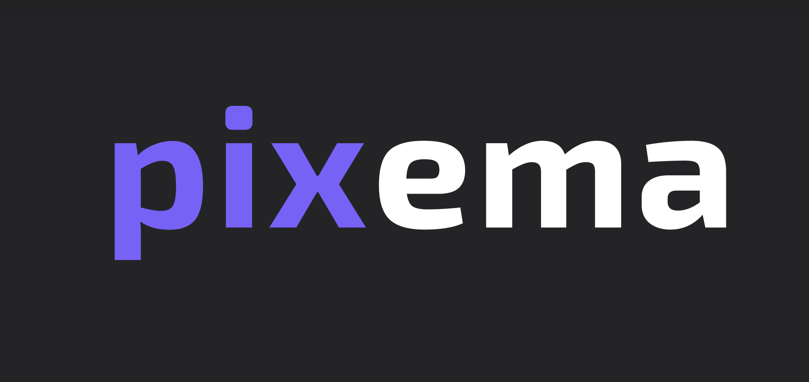

This is my diploma project made on React.

You can switch dark theme to a light using settings page.

API for this project - https://www.omdbapi.com/
You can use your key, just open the ".ENV" and put your key there (after you get it). Request limit per day - 1000.

You can visit Pixema App online using this link: https://katyamaka.github.io/React-pixema-cinema/

<div  align="center">

<h1 align="center">
  <a href="https://github.com/katyamaka/React-pixema-cinema">
    
  </a>
</h1>
</div>

<div align="center">
  <a href="https://katyamaka.github.io/React-pixema-cinema/">View Demo</a>
</div>

<details>
  <summary>Table of Contents</summary>
  <ol>
    <li>
      <a href="#about">About</a>
      <ul>
        <li><a href="#built-with">Built With</a></li>
      </ul>
    </li>
    <li>
      <a href="#getting-started">Getting Started</a>
      <ul>
        <li><a href="#installation">Installation</a></li>
      </ul>
    </li>    
    <li><a href="#usage">Usage</a></li>
    <li><a href="#contact">Contact</a></li>
  </ol>
</details>

## About

By using Pixema you can search for movies by title, add favorite movies to your list.
It has the trends tab, which contains the latest movies with the highest rating.
Also, it has a Firebase registration with the ability to change your data (email, password).

### Built With

• TypeScript
• JavaScript
• ReactJS
• React-redux
• React-router-dom
• Firebase

## Getting Started

Just install the project to see how it works.

### Installation

1. Clone the repo
   ```sh
   git clone https://github.com/katyamaka/React-pixema-cinema
   ```
2. Install NPM packages

   ```sh
   npm install
   ```

## Usage

<br>

- You can search for any movie you want.

<br>

- Every movie has a details page, where you can see any info about it:


<br/>

- If you have an account on Pixema, you can log in:


<br/>

- Or you can create your account, all you need is your e-mail:


#

## Contact

Please, contact me in case you need to ask anything. My LinkedIn is https://www.linkedin.com/in/ekaterina-makushkina-504211267/
